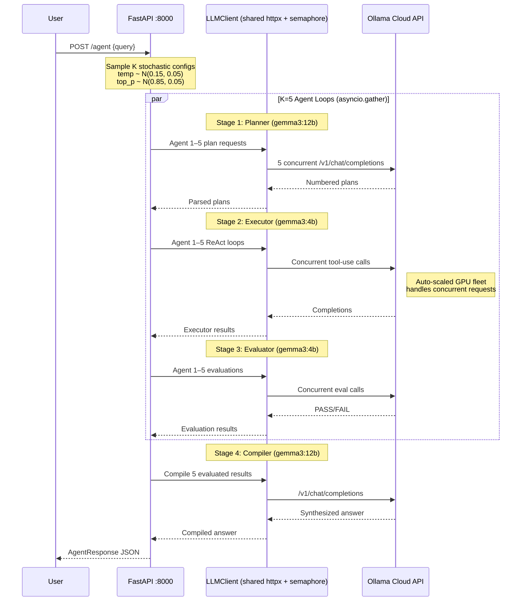
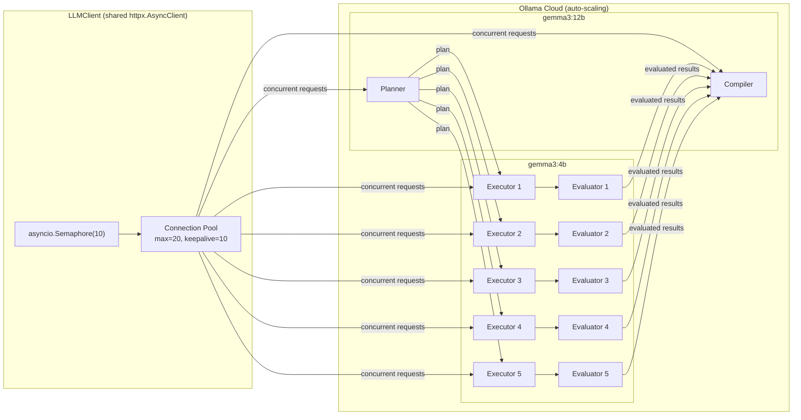

# Shoal2 Architecture — Multi-Instance Stochastic Ensemble

## Full Pipeline

## Model Routing

## State & Memory

| Type | Component | Detail |
| :--- | :--- | :--- |
| **Stochastic Config** | `sample_ensemble_configs()` | Drawn fresh from N(μ,σ) each request |
| **Worker Memory** | `messages` list | Per-agent, per-sub-task, discarded after |
| **Ensemble State** | `EnsembleMemberResult` × K | Each carries execution trace + PASS/FAIL |
| **Planner** | `gemma3:12b` via Ollama Cloud | Decomposes query into sub-tasks |
| **Compiler** | `gemma3:12b` via Ollama Cloud | Synthesizes K results into best answer |
| **LLM Client** | `llm_client.py` | Shared httpx client, connection pooling, semaphore(10) |
| **Concurrency** | `asyncio.gather` + semaphore | K=5 loops truly parallel via cloud auto-scaling |
| **Statelessness** | `main.py` | No persistence between requests |
